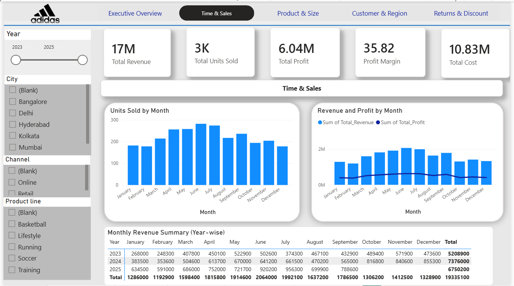
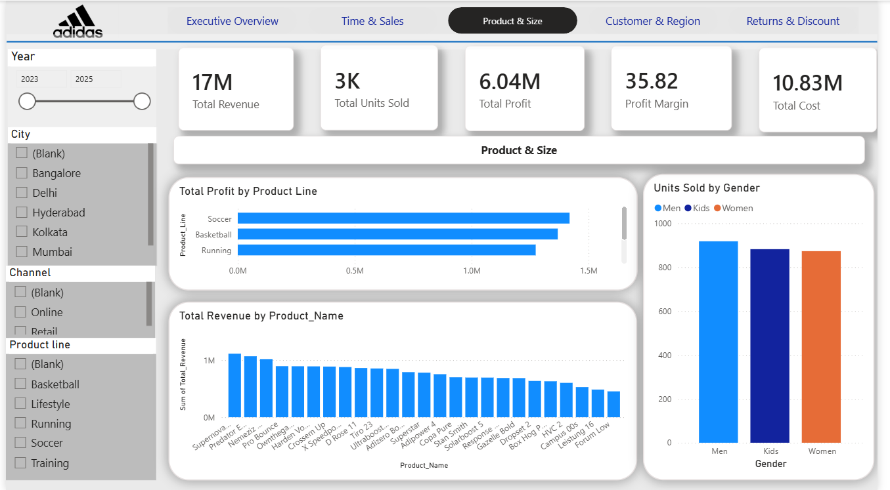
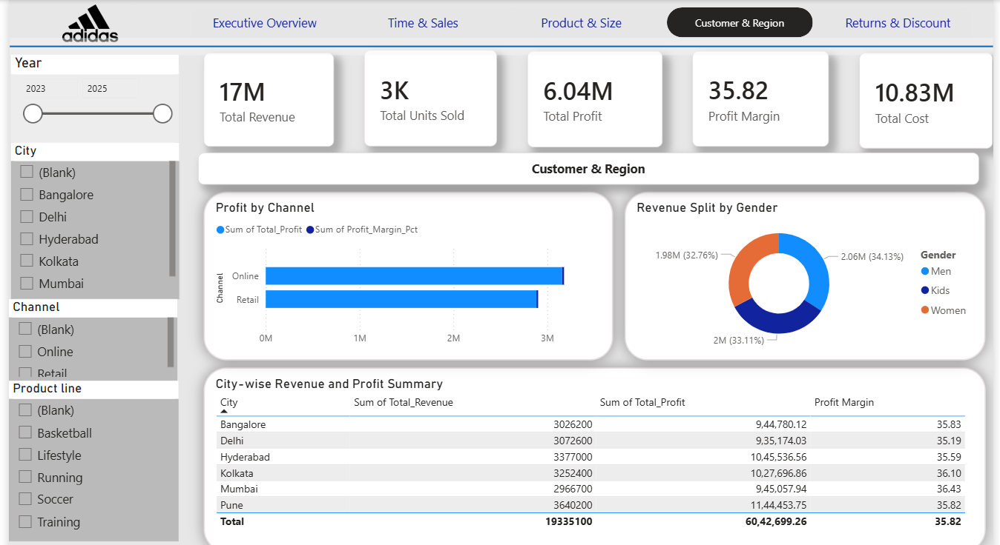
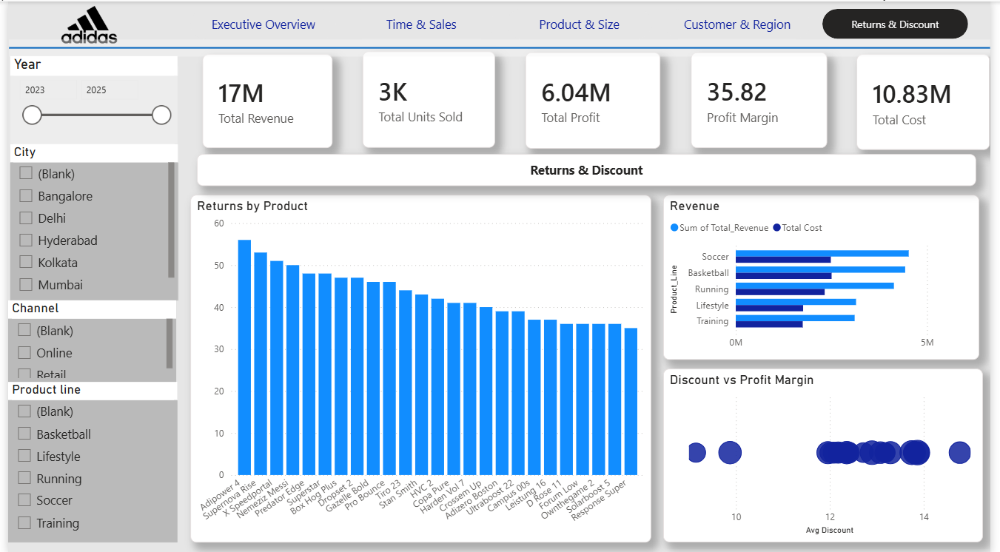

# Adidas India Sales Analytics Dashboard

## Project Overview
An interactive 5-page Power BI dashboard analyzing Adidas India 
sales performance across cities, products, channels, and time periods.

## Dashboard Pages
- **Executive Overview** – KPI cards, revenue trend, city and channel breakdown
- **Time & Sales** – Monthly revenue, units sold, year-wise matrix
- **Product & Size** – Profit by product line, revenue by product, gender analysis
- **Customer & Region** – City-wise summary, channel profit, gender split
- **Returns & Discount** – Returns by product, revenue vs cost, discount analysis

## Key Metrics
- Total Revenue: ₹17M+
- Total Units Sold: 3K+
- Profit Margin: 35%+
- Cities: Bangalore, Delhi, Hyderabad, Kolkata, Mumbai, Pune
- Years: 2023, 2024, 2025

## Tools Used
- Power BI Desktop
- DAX (Data Analysis Expressions)
- Microsoft Excel
- Data Modeling (Star Schema)

## DAX Measures Created
- Total Revenue, Total Profit, Profit Margin %
- Total Units Sold, Avg Discount
- Total Returned, Total Cost, Revenue YoY %

## Dataset
- 1,000+ sales transactions
- 4 tables: Sales_Data, Product_Master, Region_Master, Returns_Data
- Star Schema relationships

## Skills Demonstrated
- Data Cleaning and Transformation
- Data Modeling and Relationships
- DAX Measure Creation
- Interactive Dashboard Design
- Cross-filter and Slicer Interactions

## Dashboard Screenshots

### Executive Overview

### Time & Sales

### Product & Size

### Customer & Region

### Returns & Discount

